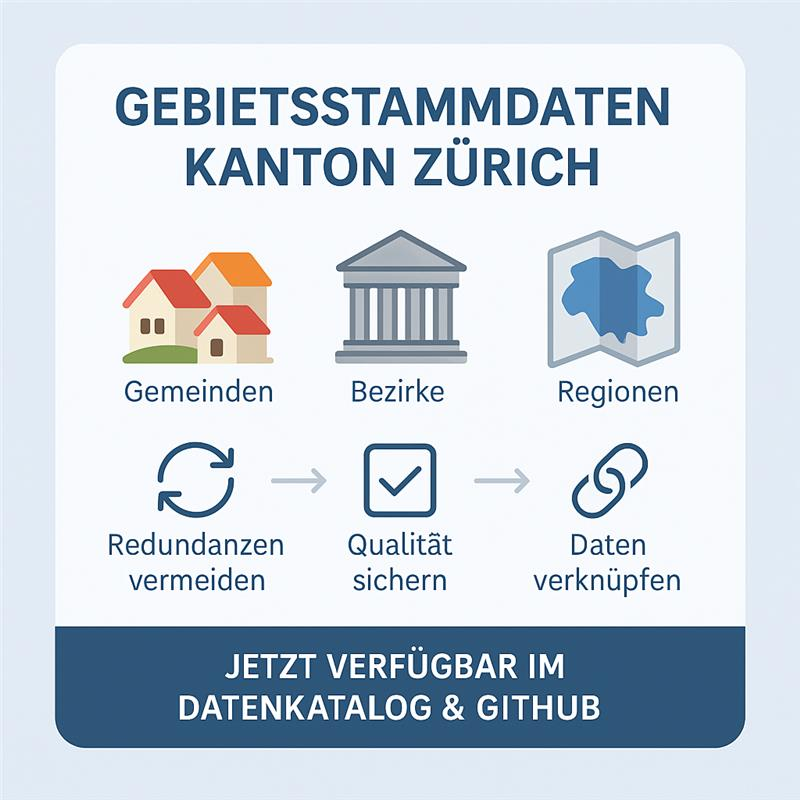
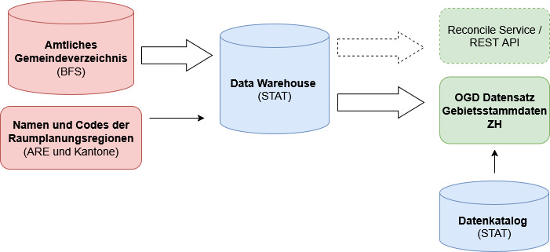

 

# Gebietsstammdaten Kanton Zürich

  

  

## Einleitung

Dieses Repository enthält die **Gebietsstammdaten** des Kantons Zürich. Es ist eine zentrale Referenz für konsistente, qualitätsgesicherte Gebietsangaben, die in kantonalen Prozessen verwendet werden.
Die Gebietsstammdaten stehen im [Kantonalen Datenkatalog](https://www.zh.ch/de/politik-staat/statistik-daten/datenkatalog.html#/datasets/3082@statistisches-amt-kanton-zuerich) zur Verfügung.

## Variablen

[**zum detaillierten Variablenbeschrieb**](Variablen.md)

## Datenflüsse

Quelle der Daten bilden das [Amtliche Gemeindeverzeichnis des Bundesamt für Statistik (BFS)](https://www.bfs.admin.ch/bfs/de/home/statistiken/querschnittsthemen/raeumliche-analysen/raeumliche-gliederungen/regionalpolitische-gliederungen.html) und die Namen und Codes der [Raumplanungsregionen, die vom Bundesamt für Raumentwicklung (ARE) und den kantonalen Raumplanungsfachstellen](https://www.bfs.admin.ch/bfs/de/home/statistiken/querschnittsthemen/raeumliche-analysen/raeumliche-gliederungen/regionalpolitische-gliederungen.html) definitiert werden. Diese werden in das Dataware House des Statistischen Amts des Kantons Zürich (STAT) geladen und aktuell gehalten. Das Dataware House des STAT ist wiederum Quelle für die automatisierte Pipeline zur Erstellung und Publikation der Gebietsstammdaten ZH als Open Governement Data (OGD) und der in naher Zukunft geplanten Programmierschnittstelle (REST API) zur Weiterverwendung und Einbindung der Gebietsstammdaten in kantonalen Datenverarbeitungsprozessen. 

  

  

## Geplante Weiterentwicklungen 

Folgende Weiterentwicklungen sind geplant:

- **Dokumentation und Anleitungen**  
  Erstellung praxisnaher Dokumentationen, Anwendungsbeispiele sowie Skripte, die zeigen, wie die API in spezifischen Anwendungsfällen eingesetzt werden kann.

  *--> Eine erste Codevorlage in R zur Historisierung der Gemeindecodes und -namen steht in den 
  [Script-Vorlagen](script_vorlagen) bereits zur Verfügung.*

- **Erweiterung des Datensatzes**  
  Die Gebietsstammdaten werden schrittweise um weitere Attribute (wie beispielsweise Koordinaten) und Gebietstypen (wie beispielsweise Kirchgemeinden) ergänzt.
  
- **REST-API**  
  Bereitstellung einer Programmierschnittstelle (REST-API), über die die Gebietsstammdaten direkt in Fachapplikationen und Prozesse eingebunden werden können. 

- **Reconcile Service für OpenRefine**  
  Ergänzend zur API ist die Entwicklung eines Reconcile-Services für [OpenRefine](https://openrefine.org/) geplant. Damit wird die komfortable Zuordnung und Bereinigung der eigenen Daten ohne Programmierkenntnisse möglich. 

## Kontakt
Haben Sie Fragen oder Feedback?   
[Schreiben Sie](mailto:dm@statistik.ji.zh.ch) ans [Team Data Management](https://www.zh.ch/de/direktion-der-justiz-und-des-innern/statistisches-amt/data-management.html) des Statistischen Amts des Kantons Zürich
oder melden Sie sich direkt bei der Stammdaten-Verantwortlichen:   
Rebekka Plüss  
rebekka.pluess@statistik.ji.zh.ch  
Telefonnummer +41 43 258 50 92 

---
