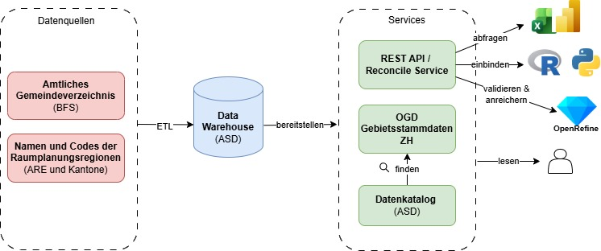

 

# Gebietsstammdaten Kanton Zürich

Dieses Repository enthält Informationen zu den **Gebietsstammdaten** des Kantons Zürich. Es ist eine zentrale Referenz für konsistente, qualitätsgesicherte Gebietsangaben, die in kantonalen Prozessen verwendet werden.
Die Gebietsstammdaten stehen im [Kantonalen Datenkatalog](https://www.zh.ch/de/politik-staat/statistik-daten/datenkatalog.html#/datasets/3082@statistisches-amt-kanton-zuerich) zur Verfügung.

## Variablen

Prinzipien der Variablennamen und detaillierter Beschrieb der einzelnen Variablen befinden sich [**im Variablenbeschrieb**](Variablen.md).

## Datenflüsse

Quelle der Daten bilden das [Amtliche Gemeindeverzeichnis des Bundesamt für Statistik (BFS)](https://www.bfs.admin.ch/bfs/de/home/grundlagen/agvch.html) und die Namen und Codes der [Raumplanungsregionen, die vom Bundesamt für Raumentwicklung (ARE) und den kantonalen Raumplanungsfachstellen](https://www.bfs.admin.ch/bfs/de/home/statistiken/querschnittsthemen/raeumliche-analysen/raeumliche-gliederungen/regionalpolitische-gliederungen.html) definitiert werden. Diese werden in das Dataware House des Statistischen Amts des Kantons Zürich (STAT) geladen und aktuell gehalten. Das Dataware House des STAT ist wiederum Quelle für die automatisierte Pipeline zur Erstellung und Publikation der Gebietsstammdaten ZH als Open Governement Data (OGD) und als Programmierschnittstelle (REST API) zur Weiterverwendung und Einbindung der Gebietsstammdaten in kantonalen Datenverarbeitungsprozessen. 

  

  

## Angebote rund um die Gebietsstammdaten

- **REST-API**  
  Es steht eine Programmierschnittstelle (REST-API) zur Verfügung, über die die Gebietsstammdaten direkt in Fachapplikationen und Prozesse eingebunden werden können. 

  *--> [Link](https://gebietsstammdaten.statistik.zh.ch/)*

- **R-Package zhGebiete**  
  Basierend auf der REST-API ermöglicht das R-Package standardisierte Abfragen der Gebietsstammdaten und die Validierung und Anreicherung der eigenen Daten.

  *--> [Link](https://github.com/statistikZH/zhGebiete)*

- **Reconcile Service für OpenRefine**  
  Integriert in der API ist auch ein Reconcile-Service für [OpenRefine](https://openrefine.org/). Damit wird die komfortable Zuordnung und Bereinigung der eigenen Daten ohne Programmierkenntnisse möglich. OpenRefine ist eine OpenSource-Applikation, welche Mitarbeitende des Kantons Zürich über das Service-Portal beziehen können.

  *--> Anleitung folgt*
  
- **Excel Add-In**  
  Mit dem Excel Add-In können auf Basis der REST-API Gemeindedaten validiert und angereichert werden. 

  *--> [Link](excel_add_in)*
  
- **Code-Vorlagen**  
  Code-Vorlagen praxisnaher Anwendungsbeisiele, die zeigen, wie die Gebietsstammdaten und die API eingesetzt werden können.

  *--> [Link](code_vorlagen)*

## Geplante Weiterentwicklungen

- **Erweiterung des Datensatzes**  
  Die Gebietsstammdaten werden schrittweise um weitere Gebietstypen (wie beispielsweise Schulgemeinden) ergänzt.

- **Erweiterung der Angebote**
  Die Angebote rund um die Gebietsstammdaten, wie die API und der Reconcile Service werden stetig gemäss den Nutzenden-Rückmeldungen optimiert.
  
## Kontakt
Haben Sie Fragen oder Feedback?   
[Schreiben Sie](mailto:dm@statistik.ji.zh.ch) ans [Team Data Management](https://www.zh.ch/de/direktion-der-justiz-und-des-innern/amt-fuer-statistik-und-daten/data-management.html) des Statistischen Amts des Kantons Zürich
oder melden Sie sich direkt bei:   
Rebekka Plüss  
rebekka.pluess@statistik.ji.zh.ch  
Telefonnummer +41 43 258 50 92 

---
