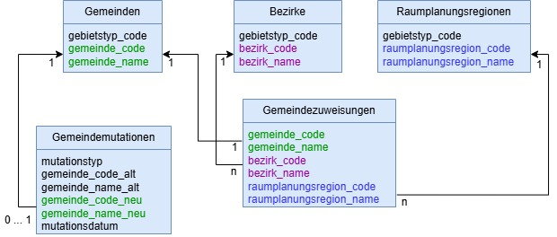

# Gebietsstammdaten ZH: Grundprinzipien, Datenmodell und Variablenbeschrieb

## Grundprinzipien

### Allgemein

Stammdaten sind oft als Wertetabellen mit **Code** und **Name** aufgebaut. Deshalb verwenden wir konsequent die Benennung:

- `<objekt>_code`
- `<objekt>_name`

Beispiel:

- `gemeinde_code`
- `gemeinde_name`

Der Code dient der eindeutigen Identifikation, der Name ist die offizielle bzw. fachlich gültige Bezeichnung.

Ziel ist es, die Variablennamen möglichst **allgemeingültig und kontextunabhängig verständlich** zu halten. Deshalb verzichten wir beispielsweise soweit möglich auf Abkürzungen.

### Gebietstypen

Jedes Gebiet gehört zu einem Gebietstyp (z. B. Gemeinde, Bezirk, Kanton). Die Gebietstypen besitzen ebenfalls einen eigenen Code (`gebietstyp_code`).

Die Codes der Gebietstypen orientieren sich wo möglich an der Systematik des Bundesamts für Statistik (BFS), insbesondere am Amtlichen Gemeindeverzeichnis (Attribut *Level*). Im Moment sind es folgende Codes:

| gebietstyp_code | gebietstyp_name |
|---|---|
| 1 | Kanton |
| 2 | Bezirk |
| 3 | Gemeinde |
| 6 | Raumplanungsregion |

Hinweise:

- Gebietstypen können – müssen aber nicht – in einer Hierarchie zueinander stehen (z. B. Kanton – Bezirk – Gemeinde). Dies wird aktuell über die Tabelle [Gemeindezuweisungen](#tabelle-gemeindezuweisungen-zu-bezirk-und-raumplanungsregion-kanton-zürich) abgebildet.

### Eindeutigkeit

Ein Gebiet ist eindeutig bestimmt durch die Kombination von:

- `gebietstyp_code`
- `gebiet_code`

Damit können alle Gebiete grundsätzlich in einer gemeinsamen Tabelle geführt und flexibel ausgewertet werden. Eine entsprechende Erweiterung ist vorgesehen.

### Unterschiedliche Variablennamen je Kontext

Es ist zu beachten, dass in anderen fachlichen oder technischen Kontexten teilweise andere Bezeichnungen etabliert sind. Der `gemeinde_code` heisst beispielsweise in anderen Systemen:

- `BFSNr`
- `MunicipalityID`
- `GDE_Nummer`
- ...

## Datenmodell

 

 

## Detaillierter Variablenbeschrieb

### Tabelle Normdaten Gemeinden Kanton Zürich

| Name | Typ | Beschreibung |
|---|---|---|
| gebietstyp_code | Zahl | Code des Gebietstyps Gemeinde (BFS-Level) |
| gemeinde_code | Zahl | Offizieller Code der Gemeinde (BFS-Nummer) |
| gemeinde_name | Text | Offizieller Name der Gemeinde (BFS-Name) |

[zu den Daten](https://www.zh.ch/de/politik-staat/statistik-daten/datenkatalog.html#/datasets/3082@statistisches-amt-kanton-zuerich/distributions/6503)

### Tabelle Normdaten Bezirke Kanton Zürich

| Name | Typ | Beschreibung |
|---|---|---|
| gebietstyp_code | Zahl | Code des Gebietstyps Bezirk (BFS-Level) |
| bezirk_code | Zahl | Offizieller Code des Bezirks (BFS-Nummer) |
| bezirk_name | Text | Offizieller Name des Bezirks (BFS-Name) |

[zu den Daten](https://www.zh.ch/de/politik-staat/statistik-daten/datenkatalog.html#/datasets/3082@statistisches-amt-kanton-zuerich/distributions/6505)

### Tabelle Normdaten Raumplanungsregionen Kanton Zürich

| Name | Typ | Beschreibung |
|---|---|---|
| gebietstyp_code | Zahl | Code des Gebietstyps Raumplanungsregion (Verwendung im STAT) |
| raumplanungsregion_code | Zahl | Offizieller Code der Raumplanungsregion (Vergabe durch ARE/Kantone) |
| raumplanungsregion_name | Text | Offizieller Name der Raumplanungsregion (Vergabe durch ARE/Kantone) |

[zu den Daten](https://www.zh.ch/de/politik-staat/statistik-daten/datenkatalog.html#/datasets/3082@statistisches-amt-kanton-zuerich/distributions/6506)

### Tabelle Gemeindezuweisungen (zu Bezirk und Raumplanungsregion) Kanton Zürich

| Name | Typ | Beschreibung |
|---|---|---|
| gemeinde_code | Zahl | Offizieller Code der Gemeinde (BFS-Nummer) |
| gemeinde_name | Text | Offizieller Name der Gemeinde (BFS-Name) |
| bezirk_code | Zahl | Offizieller Code des Bezirks (BFS-Nummer) |
| bezirk_name | Text | Offizieller Name des Bezirks (BFS-Name) |
| raumplanungsregion_code | Zahl | Code der Raumplanungsregion (Vergabe durch ARE/Kantone) |
| raumplanungsregion_name | Text | Offizieller Name der Raumplanungsregion (Vergabe durch ARE/Kantone) |

[zu den Daten](https://www.zh.ch/de/politik-staat/statistik-daten/datenkatalog.html#/datasets/3082@statistisches-amt-kanton-zuerich/distributions/6563)

### Tabelle Gemeindemutationen Kanton Zürich

| Name | Typ | Beschreibung |
|---|---|---|
| mutationstyp | Text | Mutationstyp (Namensänderung oder Fusion) |
| gemeinde_code_alt | Zahl | Offizieller Code der Gemeinde (BFS-Nummer) vor der Mutation |
| gemeinde_name_alt | Text | Offizieller Name der Gemeinde (BFS-Name) vor der Mutation |
| gemeinde_code_neu | Zahl | Offizieller Code der Gemeinde (BFS-Nummer) nach der Mutation |
| gemeinde_name_neu | Text | Offizieller Name der Gemeinde (BFS-Name) nach der Mutation |
| mutationsdatum | Datum | Datum der Mutation |

[zu den Daten](https://www.zh.ch/de/politik-staat/statistik-daten/datenkatalog.html#/datasets/3082@statistisches-amt-kanton-zuerich/distributions/6504)
