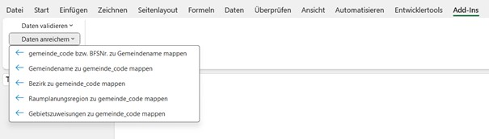

# Gebietsstammdaten ZH – Excel Add-In

<strong>Inhaltsverzeichnis</strong>

- [Verwendung des Add-Ins](#verwendung-des-add-ins)
- [Funktionen](#funktionen)
  - [1 Daten validieren](#1-daten-validieren)
  - [2 Daten anreichern um Gemeindecode bwz. BFSNr.](#2-daten-anreichern-um-gemeindecode-bwz-bfsnr)
  - [3 Daten anreichern um weitere Attribute](#3-daten-anreichern-um-weitere-attribute)
  - [4 Daten konvertieren](#4-daten-konvertieren)
- [Excel-Formeln](#excel-formeln)
- [Tipps](#tipps)
- [Lizenz](#lizenz)

Dieses Excel Add-In unterstützt die Arbeit mit Gemeindenamen, Gemeindecodes (BFSNr.) und Gebietszuweisungen für den Kanton Zürich. Es bietet Funktionen zur **Validierung** und **Anreicherung** von Gemeindedaten direkt in Excel. Die Funktionen verwenden die [API Gebietsstammdaten](https://gebietsstammdaten.statistik.zh.ch/) des Statistischen Amts des Kantons Zürich.

  

## Verwendung des Add-Ins

1. `Gebietsstammdaten_V1.1.xlsm` herunterladen, öffnen und zum Bearbeiten / Add-Ins aktivieren.
2. Die zu bearbeitenden Daten in ein neues Worksheet in `Gebietsstammdaten_V1.xlsm` kopieren und da bearbeiten, oder:
3. `Gebietsstammdaten_V1.1.xlsm` und das zu bearbeitende Excel gleichzeitig offen haben.
   
   > Hinweis: In diesem Fall kann es beim ersten Ausführen einer Funktion notwendig sein, die Schaltfläche **zweimal** zu klicken, bis sie ausgeführt wird.

Alle Funktionen befinden sich unter **Add-Ins**. 

## Funktionen

Die Funktionen entsprechen in ihrer Reihenfolge dem üblichen Anwendungsfall

1. Die Gemeindenamen gemäss dem offiziellen Gemeindenamen des BFS validieren
2. Zum Gemeindenamen den Gemeinde-Code bzw. die BFS-Nr. mappen
3. Weitere Attribute (wie beispielsweise Bezirke) zum Gemeinde-Code mappen
4. Daten konvertieren (Formatierungen entfernen)

### 1 Gemeindename validieren

- **Gemeindename validieren (original Spalte behalten)**  

  Validiert die Gemeindenamen in einer neuen Spalte
  
  - Grün: Name entspricht dem offiziellen BFS-Namen  
  - Orange: Mehrere Treffer – Dropdown zur Auswahl  
  - Rot: Kein Treffer  

- **Gemeindename in der selben Spalte nachvalidieren**  
  Führt die gleiche Validierung durch, überschreibt jedoch die Originalspalte (ist zur Nachvalidierung nach den vorgenommenen Korrekturen gedacht

[Demo_Gemeindenamen_validieren.mp4](https://github.com/statistikZH/gebietsstammdaten_zh/issues/1#issue-3813179519)

### 2 Gemeindedaten anreichern um Gemeindecode bwz. BFSNr.

- **gemeinde_code bzw. BFSNr. zu Gemeindename mappen (Schritt 2)** 
  Fügt rechts neben dem Code die offizielle Gemeinde ein.

### 3 Gemeindedaten anreichern um weitere Attribute

- **Gemeindename zu gemeinde_code mappen**  
  Ermittelt zum offiziellen Gemeindenamen des BFS den zughörigen Gemeinde-Code (BFSNr).

- **Gebietszuweisungen zu gemeinde_code mappen**  
  Ermittelt Bezirk, Raumplanungsregion und weitere Attribute anhand des Gemeinde-Codes.

- **Bezirk zu gemeinde_code mappen**  
  Fügt Bezirk-Code und Bezirk-Name rechts neben dem Gemeinde-Code ein.

- **Raumplanungsregion zu gemeinde_code mappen**  
  Fügt Raumplanungsregion-Code und Name rechts neben dem Gemeinde-Code ein.

[Demo_Gemeindedaten_anreichern.mp4](https://github.com/statistikZH/gebietsstammdaten_zh/issues/3#issue-3813196220)

### 4 Daten bereinigen

- **Ausgewählte Zellen in Werte umwandeln**  
  Wandelt alle Formeln in der markierten Auswahl in feste Werte um und entfernt Formeln. Das kann vor allem aus Performance-Gründen sehr nützlich sein. Zudem werden so die Werte auch für den Offline-Modus gesichert (Formeln greifen immer auf die API zu).

- **Einfärbungen und Dropdown-Listen aus ausgewählten Zellen entfernen**  
  Entfernt Formatierungen zur Datenvalidierungen (Dropdowns) aus der Auswahl.

[Demo_Daten_bereinigen.mp4](https://github.com/statistikZH/gebietsstammdaten_zh/issues/4#issue-3813198100)
---
## Excel-Formeln

Die folgenden Funktionen können auch direkt als Formeln in Excel-Zellen verwendet werden:

 `=validate_gemeinde_name(gemeinde_name)` liefert die offiziellen Gemeindennamen als Text oder bei mehreren Treffern als Liste (mit `;` getrennt).
 
`=map_gemeinde_code_to_name(gemeinde_code)` liefert den Gemeindename zum angegebenen `gemeinde_code`. 

`=map_gemeindezuweisungen_to_code(gemeinde_code; attribut)` liefert den Attributwert zu einem `gemeinde_code`. Eingabemöglichkeiten bei attribut:
- "gemeinde_name"
- "bezirk_code"
- "bezirk_name"
- "raumplanungsregion_code"
- "raumplanungsregion_name"

> Hinweis: Alle Formeln rufen die API auf. Stell sicher, dass eine Internetverbindung besteht.

[Demo_Formeln_anwenden.mp4](https://github.com/statistikZH/gebietsstammdaten_zh/issues/5#issue-3813199239)

## Tipps

- Für die Arbeit in grösseren Tabellen empfiehlt es sich, zuerst die Validierung durchzuführen, anschliessend die Anreicherung.
- Vor der Anwendung empfiehlt es sich, ein Backup der Originaldatei zu sichern.
- Die Funktionen arbeiten am zuverlässigsten, wenn die Gemeinde-Spalte **keine leeren Zeilen** enthält.

---

## Lizenz

Dieses Repository steht unter [MIT Lizenz](LICENSE). Sie dürfen die Makros frei verwenden, verändern und weitergeben.
